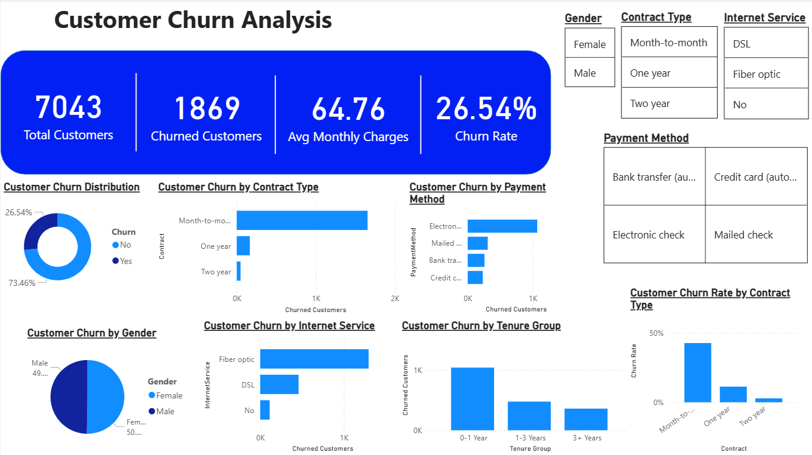

# 📊 End-to-End Customer Churn Analytics Platform & Web Application

[](https://rohit661199-customer-churn-analysis-app-vrg5cf.streamlit.app/)
[](https://github.com/rohit661199/Customer-Churn-Analysis)
[](powerbi/@dashboard.pbix)

---

## 🌐 Live Interactive Web Application
👉 **[Launch Live Customer Churn Web App](https://rohit661199-customer-churn-analysis-app-vrg5cf.streamlit.app/)**

---

## 📌 Executive Summary

This project is a comprehensive **End-to-End Data Analytics Platform & Cloud Web Application** designed to diagnose, visualize, and mitigate customer churn in the telecommunications industry. 

It combines traditional **Power BI business intelligence**, **relational SQL analytics**, and **Python Exploratory Data Analysis (EDA)** with a **cloud-deployed Streamlit web application** that supports **dynamic CSV file uploads** for instant, automated dataset analysis.

---

## 🎯 Problem Statement & Business Impact

Customer attrition is one of the highest cost drivers in subscription-based services. Retaining existing customers is up to 5x cheaper than acquiring new ones.

* **Total Analyzed Customers:** 7,043
* **Churned Customers:** 1,869
* **Overall Churn Rate:** 26.54%
* **Monthly Revenue Lost:** **$139,130.85**

---

## 🚀 Key Features

### 🌐 1. Dynamic Streamlit Web Application (Cloud Deployed)
* **Live Link:** [rohit661199-customer-churn-analysis-app-vrg5cf.streamlit.app](https://rohit661199-customer-churn-analysis-app-vrg5cf.streamlit.app/)
* **Dynamic CSV Drag-and-Drop:** Upload any customer churn CSV dataset to re-calculate all KPIs, Plotly charts, demographics, and recommendations in real time.
* **Interactive Slicers:** Filter by Gender, Senior Citizen status, Contract Type, Internet Service, Payment Method, and Tenure.
* **5-Tab Analytics Layout:**
  1. 📈 **Overview & Churn Drivers** (Donut, Pie & Bar charts matching Power BI)
  2. 💵 **Financial & Revenue Impact** (SVG Scatter plot, Box plot, Revenue loss per payment method)
  3. 👥 **Demographics & Services** (Senior citizen impact, Family structure, Add-on service usage)
  4. 💡 **Strategic Recommendations** (Actionable business retention strategies)
  5. 📋 **Data & SQL Queries** (Interactive data table with CSV export & 10 embedded SQL scripts)

### 📊 2. Power BI Business Intelligence Dashboard
* **File:** [`powerbi/@dashboard.pbix`](powerbi/@dashboard.pbix)
* Interactive executive dashboard featuring DAX measures, contract breakdown, payment distribution, and gender analysis.
* **Local Refresh Support:** Swap `dataset/churn_data.csv` locally and click **Refresh** in Power BI Desktop to update all visuals.

### 💻 3. Relational SQL Queries
* **File:** [`sql/churn_analysis.sql`](sql/churn_analysis.sql)
* Includes 10 analytical queries for calculating overall churn rate, revenue impact, tenure grouping, contract distributions, and high-risk segment identification.

### 🐍 4. Python EDA & Data Processing
* **File:** [`python/customer_churn_analysis.ipynb`](python/customer_churn_analysis.ipynb)
* Preprocessing, handling missing values, numeric conversions, feature engineering (`TenureGroup`), and visualization.

---

## 🖼️ Dashboard Preview



---

## 📊 Key Business Insights & Actionable Recommendations

| Insight | Driver Identified | Strategic Recommendation |
| :--- | :--- | :--- |
| **Contract Risk** | Month-to-Month contracts have a **42.7% churn rate** vs <3% for 2-year contracts. | Launch targeted 10-15% discount campaigns for switching to 1-year/2-year plans. |
| **Fiber Optic Discontent** | Fiber Optic users churn at **41.9%** vs 19.0% for DSL users. | Audit network reliability and accelerate tech support response times for Fiber lines. |
| **Payment Friction** | Electronic Check users account for **57%+ of all churned customers**. | Offer a $5 bill credit incentive to encourage automatic bank/credit card payments. |
| **Early Tenure Attrition** | Over **55% of all churn occurs within the first 12 months**. | Implement proactive check-ins at Months 1, 3, and 6 with free onboarding support. |

---

## 🛠️ Tools & Technologies Used

* **Streamlit & Python (Pandas, Plotly, NumPy):** Dynamic Web App & Cloud Deployment
* **Power BI Desktop:** Business Intelligence & Executive Dashboarding
* **SQL:** Data Aggregation & Querying
* **HTML5 / CSS3 / JavaScript:** Web Presentation Dashboard (`index.html`)
* **Git & GitHub / Streamlit Cloud:** Version Control & Cloud CI/CD Hosting

---

## 📁 Repository Structure

```
Customer-Churn-Analysis/
├── app.py                      # Streamlit Cloud Web Application
├── index.html                  # Interactive GitHub Pages Web Dashboard
├── dataset/
│   └── churn_data.csv          # Default Telecom Dataset (7,043 rows)
├── powerbi/
│   └── @dashboard.pbix         # Power BI Desktop File
├── python/
│   ├── customer_churn_analysis.ipynb # Jupyter EDA Notebook
│   └── churn_analysis.html     # HTML Export of EDA Analysis
├── sql/
│   └── churn_analysis.sql      # 10 Analytical SQL Queries
├── test_sample_churn.csv       # Sample Test CSV for Dynamic Upload Testing
├── churn_dashboard.png         # Executive Dashboard Preview
└── README.md                   # Platform Documentation
```

---

## 👤 Author

**Rohit**  
*Data Analyst & Web Application Developer*  
* **GitHub:** [@rohit661199](https://github.com/rohit661199)  
* **Live App:** [Customer Churn Analytics App](https://rohit661199-customer-churn-analysis-app-vrg5cf.streamlit.app/)
